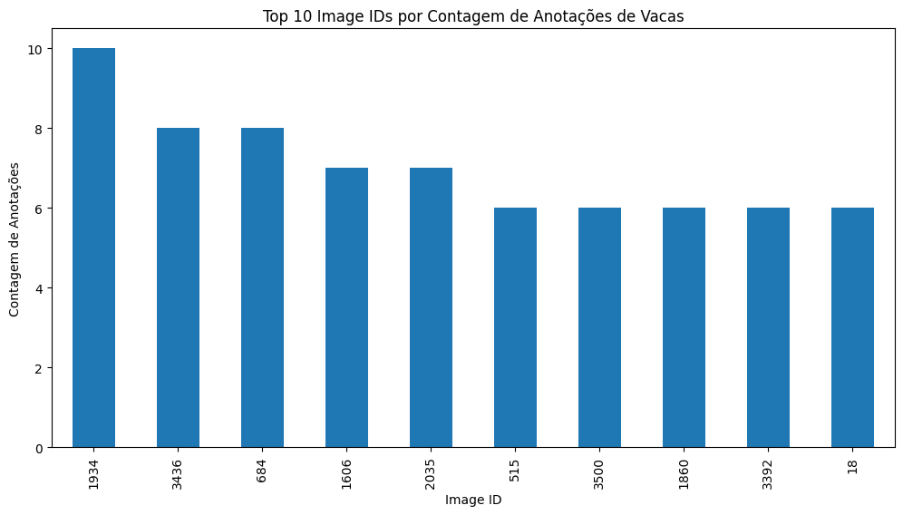
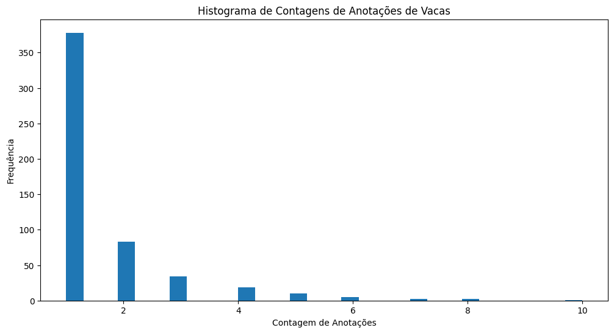
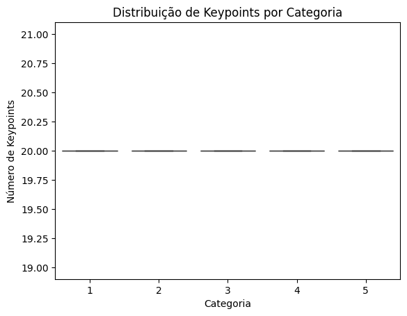
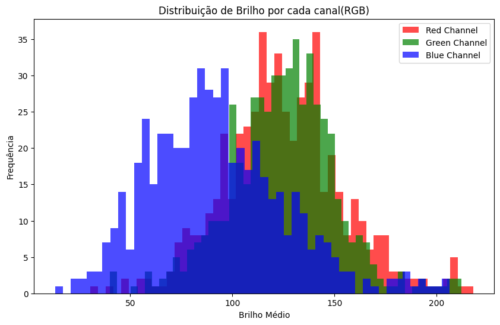

# Animal_Pose_Estimation

Este projeto visa desenvolver e implementar o chamado pose estimation, especificamente projetado para classe animal de bovinos. Tal sistema identifica keypoints(localizações específicas/coordenadas) em bovinos a partir de imagens.

## Estrutura do Projeto
O projeto inclui os seguintes componentes principais:

Filtragem de imagens: filtragem de animais bovinos, separando esses animais dos demais presente no dataset.
Detecção de keypoints: Código para realizar a detecção de keypoints em imagens.
Scripts de Pré-processamento: Código que aplica vários filtros sobre a imagem, trabalhando em etapas e retornando uma imagem pré-processada com as alterações durante o processo.

## Separação da classe bovinos
No dataset ANIMAL-POSE DATASET, a separação dos bovinos de outros animais foi feita utilizando anotações categorizadas por category_id, onde o ID 5 está associado a bovinos. Utilizando a função select_annotations_by_category, todas as anotações relacionadas aos bovinos foram filtradas a partir do DataFrame completo de anotações.
A estrutura original possui as seguintes categorias de animais:
1 - Gato;
2 - Cachorro;
3 - Cavalo;
4 - Ovelha;
**5 - Bovinos**

## Filtros aplicados no pré-processamento
O pré-processamento das imagens envolveu várias etapas de filtragem para melhorar a qualidade visual e destacar características importantes, facilitando a detecção de keypoints. As etapas de filtragem incluíram:

Gaussian Blur: Um filtro de desfoque gaussiano foi aplicado para suavizar as imagens, reduzindo o ruído e as variações de intensidade entre os pixels que poderiam afetar a identificação de keypoints.

Unsharp Mask: Após o desfoque, utilizou-se uma máscara de nitidez para realçar detalhes da imagem, compensando o efeito de suavização do desfoque gaussiano.

Contrast Enhancement: O contraste das imagens foi intensificado para tornar as diferenças de cor mais distintas, melhorando assim a separação visual, o que facilita a detecção de keypoints.

## Analise de gráficos e resultados

### 1. 10 image IDs por contagem de anotações de bovinos
Este gráfico de barras mostra a contagem de anotações para os dez IDs de imagens com mais anotações dentro do dataset de bovinos.

Distribuição: A distribuição mostra que algumas imagens têm significativamente mais anotações que outras, indicando uma possível variação na qualidade ou no conteúdo visual das imagens.

Utilidade: O gráfico é útil para identificar quais imagens podem requerer uma revisão mais detalhada, talvez devido à complexidade ou de mais características.

### 2. Histograma de contagens de anotações de bovinos
Este histograma representa a frequência das contagens de anotações por imagem

Poucas Anotações: A maioria das imagens tem poucas anotações, como indicado pela barra mais alta para imagens com apenas duas anotações.

Além disso, uma alta frequência de imagens com poucas anotações pode sugerir limitações no dataset, como uma possível sub-representação de poses complexas em muitas das imagens.

### 3. Boxplot da distribuição de keypoints por categoria
Este boxplot mostra a variabilidade na distribuição do número de keypoints para diferentes categorias de animais.

Baixa Variabilidade: As categorias exibem uma distribuição estreita de keypoints, com mediana e quartis próximos uns dos outros, o que indica consistência nas anotações entre diferentes categorias.

Ausência de Outliers: A falta de outliers pode indicar que os dados são bem controlados e que não há erros de anotação.

### 4. Distribuição de Brilho por Canal RGB
Este histograma detalha a distribuição média de brilho para cada canal de cor (RGB) nas imagens processadas.

Variação de Brilho: O canal azul mostra uma distribuição mais ampla de brilho, indicando variação na iluminação ou características das imagens que afetam esse canal mais significativamente.

Ainda há algumas implicações, como por exemplo a informação sobre a distribuição de brilho para ajustar o pré-processamento de imagens, isso parece indicar a necessidade de normalização para melhorar as imagens.

## Principais limitações

* Dependendo da posição que o animal se encontra, dificulta a detecção de keypoints na imagem;
* Dificuldade de filtrar animais como bovinos, em certos momentos, havia filtragem de outros animais na classificação, levando tempo até filtrar corretamente apenas bovinos;
* Mesmo com a redução após a filtragem, encontrou-se problemas ao renderizar todos os bovinos como confirmação que apenas está classe estava sendo filtrada, tendo que em certo momento parar a rodagem destes para não exceder os limites do Colab, necessitando de GPU por exemplo, como também comentar parte do código para o arquivo não ficar pesado;
* O dataset tinha imagens com ruídos e baixa-qualidade, isso dificulta o processo de identificação e filtragem, principalmente em relação aos keypoints.

## Principais aprendizados
* Mesmo com um modelo tendo várias imagens, trazer uma maior generalização desses dados seria uma boa ideia para contribuir numa melhor identificação de várias poses;
* A etapa de pré-processamento pode ser mais refinado para melhorar mais as imagens, aplicando por exemplo otimização. Nessa etapa houve uma certa melhora, porém tem potencial de ter uma qualidade superior;
* Implementar uma rede convolucional como CNN poderia facilitar todo o processo de filtragem e análise, ainda mais mirando no processo de classificação.
